::::::::::::::::::::::::::::::::::::::: objectives

- Know the difference between point, line, and polygon vector elements.
- Load point, line, and polygon vector layers into R.
- Access the attributes of a spatial object in R.

::::::::::::::::::::::::::::::::::::::::::::::::::

:::::::::::::::::::::::::::::::::::::::: questions

- How can I distinguish between and visualize point, line and polygon vector data?

::::::::::::::::::::::::::::::::::::::::::::::::::


::::::::::::::::::::::::::::::::::::::::::  prereq

## Things You'll Need To Complete This Episode

See the [lesson homepage](.) for detailed information about the software, data,
and other prerequisites you will need to work through the examples in this
episode.


::::::::::::::::::::::::::::::::::::::::::::::::::

:::::::::::::::::::::::::::::::::::::::::  callout

## Introduce the Data

If not already discussed, introduce the datasets that will be used in this
lesson. A brief introduction to the datasets can be found on the
[Geospatial workshop homepage](https://datacarpentry.org/geospatial-workshop/#data).

For more detailed information about the datasets, check
out the [Geospatial workshop data
page](https://datacarpentry.org/geospatial-workshop/data/).


::::::::::::::::::::::::::::::::::::::::::::::::::


In this episode, we will open and plot point, line
and polygon vector data loaded from ESRI's `shapefile` format into R. These data refer to the
[NEON Harvard Forest field site](https://www.neonscience.org/field-sites/field-sites-map/HARV),
which we have been working with in previous episodes. In later episodes, we will learn how to work with raster and vector data together and combine them
into a single plot.

## Import Vector Data

We will use the `sf` package to work with vector data in R. `sf` stands for
[simple features](https://en.wikipedia.org/wiki/Simple_Features), an international standard for
representing spatial data that is used widely by databases (e.g., PostGIS) and other open source
geospatial software (e.g., GDAL). We will also use the `terra` package, which has been loaded
in previous episodes, so we can explore raster and vector spatial metadata using similar commands.

Make sure you have the `sf` library loaded.


``` r
library(sf)
```

The vector layers that we will import from ESRI's `shapefile` format are:

- A polygon vector layer representing our field site boundary,
- A line vector layer representing roads, and
- A point vector layer representing the location of the [Fisher flux tower](https://www.neonscience.org/data-collection/flux-tower-measurements)
  located at the [NEON Harvard Forest field site](https://www.neonscience.org/field-sites/field-sites-map/HARV).

The first vector layer that we will open contains the boundary of our study area
(or our Area Of Interest or AOI, hence the name `aoiBoundary`). To import
a vector layer from an ESRI `shapefile` we use the `sf` function `st_read()`. `st_read()`
requires the file path to the ESRI `shapefile`.

Let's import our AOI:


``` r
aoi_boundary_harv <- st_read(
  "data/NEON-DS-Site-Layout-Files/HARV/HarClip_UTMZ18.shp")
```

``` output
Reading layer `HarClip_UTMZ18' from data source 
  `/home/runner/work/r-raster-vector-geospatial/r-raster-vector-geospatial/site/built/data/NEON-DS-Site-Layout-Files/HARV/HarClip_UTMZ18.shp' 
  using driver `ESRI Shapefile'
Simple feature collection with 1 feature and 1 field
Geometry type: POLYGON
Dimension:     XY
Bounding box:  xmin: 732128 ymin: 4713209 xmax: 732251.1 ymax: 4713359
Projected CRS: WGS 84 / UTM zone 18N
```

## Vector Layer Metadata \& Attributes

When we import the `HarClip_UTMZ18` vector layer from an ESRI `shapefile` into R (as our
`aoi_boundary_harv` object), the `st_read()` function automatically stores
information about the data. We are particularly interested in the geospatial
metadata, describing the format, CRS, extent, and other components of the
vector data, and the attributes which describe properties associated with each
individual vector object.


## Spatial Metadata

Key metadata for all vector layers includes:

1. **Object Type:** the class of the imported object.
2. **Coordinate Reference System (CRS):** the projection of the data.
3. **Extent:** the spatial extent (i.e. geographic area that the vector layer
   covers) of the data. Note that the spatial extent for a vector layer
   represents the combined extent for all individual objects in the vector layer.

We can view metadata of a vector layer using the `st_geometry_type()`, `st_crs()` and
`st_bbox()` functions. First, let's view the geometry type for our AOI
vector layer:


``` r
st_geometry_type(aoi_boundary_harv)
```

``` output
[1] POLYGON
18 Levels: GEOMETRY POINT LINESTRING POLYGON MULTIPOINT ... TRIANGLE
```

Our `aoi_boundary_harv` is a polygon spatial object. The 18 levels shown below our
output list the possible categories of the geometry type. Now let's check what
CRS this file data is in:


``` r
st_crs(aoi_boundary_harv)
```

``` output
Coordinate Reference System:
  User input: WGS 84 / UTM zone 18N 
  wkt:
PROJCRS["WGS 84 / UTM zone 18N",
    BASEGEOGCRS["WGS 84",
        DATUM["World Geodetic System 1984",
            ELLIPSOID["WGS 84",6378137,298.257223563,
                LENGTHUNIT["metre",1]]],
        PRIMEM["Greenwich",0,
            ANGLEUNIT["degree",0.0174532925199433]],
        ID["EPSG",4326]],
    CONVERSION["UTM zone 18N",
        METHOD["Transverse Mercator",
            ID["EPSG",9807]],
        PARAMETER["Latitude of natural origin",0,
            ANGLEUNIT["Degree",0.0174532925199433],
            ID["EPSG",8801]],
        PARAMETER["Longitude of natural origin",-75,
            ANGLEUNIT["Degree",0.0174532925199433],
            ID["EPSG",8802]],
        PARAMETER["Scale factor at natural origin",0.9996,
            SCALEUNIT["unity",1],
            ID["EPSG",8805]],
        PARAMETER["False easting",500000,
            LENGTHUNIT["metre",1],
            ID["EPSG",8806]],
        PARAMETER["False northing",0,
            LENGTHUNIT["metre",1],
            ID["EPSG",8807]]],
    CS[Cartesian,2],
        AXIS["(E)",east,
            ORDER[1],
            LENGTHUNIT["metre",1]],
        AXIS["(N)",north,
            ORDER[2],
            LENGTHUNIT["metre",1]],
    ID["EPSG",32618]]
```

Our data in the CRS **UTM zone 18N**. The CRS is critical to interpreting the
spatial object's extent values as it specifies units. To find the extent of our AOI, we
can use the `st_bbox()` function:


``` r
st_bbox(aoi_boundary_harv)
```

``` output
     xmin      ymin      xmax      ymax 
 732128.0 4713208.7  732251.1 4713359.2 
```

The spatial extent of a vector layer or R spatial object represents the geographic
"edge" or location that is the furthest north, south east and west. Thus it
represents the overall geographic coverage of the spatial object. Image Source:
National Ecological Observatory Network (NEON).

{alt='Extent image'}

Lastly, we can view all of the metadata and attributes for this R spatial
object by printing it to the screen:


``` r
aoi_boundary_harv
```

``` output
Simple feature collection with 1 feature and 1 field
Geometry type: POLYGON
Dimension:     XY
Bounding box:  xmin: 732128 ymin: 4713209 xmax: 732251.1 ymax: 4713359
Projected CRS: WGS 84 / UTM zone 18N
  id                       geometry
1  1 POLYGON ((732128 4713359, 7...
```

## Plot a vector layer

Next, let's visualize the data in our `sf` object using the `ggplot` package.
Unlike with raster data, we do not need to convert vector data to a dataframe
before plotting with `ggplot`.

We're going to customize our boundary plot by setting the size, color, and fill
for our plot. When plotting `sf` objects with `ggplot2`, you need to use the
`coord_sf()` coordinate system.


``` r
ggplot() +
  geom_sf(data = aoi_boundary_harv, size = 3, color = "black", fill = "cyan1") +
  ggtitle("AOI Boundary Plot") +
  coord_sf()
```

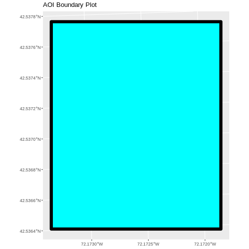


On the boundary plot, the x and y axes are labeled in units of decimal degrees. However, the CRS
for `aoi_boundary_harv` is UTM zone 18N, which has units of meters. `geom_sf` will use
the CRS of the data to set the CRS for the plot, so why is there a mismatch?

By default, `coord_sf()` generates a graticule with a CRS of WGS 84 (where the units
are decimal degrees), and this sets our axis labels. To draw the graticule in the native
CRS of our shapefile, we can set `datum=NULL` in the `coord_sf()` function.


## Spatial Data Attributes

We introduced the idea of spatial data attributes in
[an earlier lesson](https://datacarpentry.org/organization-geospatial/02-intro-vector-data).
Now we will explore how to use spatial data attributes stored in our data to
plot different features.


:::::::::::::::::::::::::::::::::::::::  challenge

## Challenge: Import Line and Point Vector Layers

Using the steps above, import the HARV\_roads and HARVtower\_UTM18N vector layers into
R. Call the HARV\_roads object `lines_harv` and the HARVtower\_UTM18N
`point_harv`.

Answer the following questions:

1. What type of R spatial object is created when you import each layer?

2. What is the CRS and extent for each object?

3. Do the files contain points, lines, or polygons?

4. How many spatial objects are in each file?

:::::::::::::::  solution

## Answers

First we import the data:


``` r
lines_harv <- st_read("data/NEON-DS-Site-Layout-Files/HARV/HARV_roads.shp")
```

``` output
Reading layer `HARV_roads' from data source 
  `/home/runner/work/r-raster-vector-geospatial/r-raster-vector-geospatial/site/built/data/NEON-DS-Site-Layout-Files/HARV/HARV_roads.shp' 
  using driver `ESRI Shapefile'
Simple feature collection with 13 features and 15 fields
Geometry type: MULTILINESTRING
Dimension:     XY
Bounding box:  xmin: 730741.2 ymin: 4711942 xmax: 733295.5 ymax: 4714260
Projected CRS: WGS 84 / UTM zone 18N
```

``` r
point_harv <- st_read("data/NEON-DS-Site-Layout-Files/HARV/HARVtower_UTM18N.shp")
```

``` output
Reading layer `HARVtower_UTM18N' from data source 
  `/home/runner/work/r-raster-vector-geospatial/r-raster-vector-geospatial/site/built/data/NEON-DS-Site-Layout-Files/HARV/HARVtower_UTM18N.shp' 
  using driver `ESRI Shapefile'
Simple feature collection with 1 feature and 14 fields
Geometry type: POINT
Dimension:     XY
Bounding box:  xmin: 732183.2 ymin: 4713265 xmax: 732183.2 ymax: 4713265
Projected CRS: WGS 84 / UTM zone 18N
```

Then we check its class:


``` r
class(lines_harv)
```

``` output
[1] "sf"         "data.frame"
```

``` r
class(point_harv)
```

``` output
[1] "sf"         "data.frame"
```

We also check the CRS and extent of each object:


``` r
st_crs(lines_harv)
```

``` output
Coordinate Reference System:
  User input: WGS 84 / UTM zone 18N 
  wkt:
PROJCRS["WGS 84 / UTM zone 18N",
    BASEGEOGCRS["WGS 84",
        DATUM["World Geodetic System 1984",
            ELLIPSOID["WGS 84",6378137,298.257223563,
                LENGTHUNIT["metre",1]]],
        PRIMEM["Greenwich",0,
            ANGLEUNIT["degree",0.0174532925199433]],
        ID["EPSG",4326]],
    CONVERSION["UTM zone 18N",
        METHOD["Transverse Mercator",
            ID["EPSG",9807]],
        PARAMETER["Latitude of natural origin",0,
            ANGLEUNIT["Degree",0.0174532925199433],
            ID["EPSG",8801]],
        PARAMETER["Longitude of natural origin",-75,
            ANGLEUNIT["Degree",0.0174532925199433],
            ID["EPSG",8802]],
        PARAMETER["Scale factor at natural origin",0.9996,
            SCALEUNIT["unity",1],
            ID["EPSG",8805]],
        PARAMETER["False easting",500000,
            LENGTHUNIT["metre",1],
            ID["EPSG",8806]],
        PARAMETER["False northing",0,
            LENGTHUNIT["metre",1],
            ID["EPSG",8807]]],
    CS[Cartesian,2],
        AXIS["(E)",east,
            ORDER[1],
            LENGTHUNIT["metre",1]],
        AXIS["(N)",north,
            ORDER[2],
            LENGTHUNIT["metre",1]],
    ID["EPSG",32618]]
```

``` r
st_bbox(lines_harv)
```

``` output
     xmin      ymin      xmax      ymax 
 730741.2 4711942.0  733295.5 4714260.0 
```

``` r
st_crs(point_harv)
```

``` output
Coordinate Reference System:
  User input: WGS 84 / UTM zone 18N 
  wkt:
PROJCRS["WGS 84 / UTM zone 18N",
    BASEGEOGCRS["WGS 84",
        DATUM["World Geodetic System 1984",
            ELLIPSOID["WGS 84",6378137,298.257223563,
                LENGTHUNIT["metre",1]]],
        PRIMEM["Greenwich",0,
            ANGLEUNIT["degree",0.0174532925199433]],
        ID["EPSG",4326]],
    CONVERSION["UTM zone 18N",
        METHOD["Transverse Mercator",
            ID["EPSG",9807]],
        PARAMETER["Latitude of natural origin",0,
            ANGLEUNIT["Degree",0.0174532925199433],
            ID["EPSG",8801]],
        PARAMETER["Longitude of natural origin",-75,
            ANGLEUNIT["Degree",0.0174532925199433],
            ID["EPSG",8802]],
        PARAMETER["Scale factor at natural origin",0.9996,
            SCALEUNIT["unity",1],
            ID["EPSG",8805]],
        PARAMETER["False easting",500000,
            LENGTHUNIT["metre",1],
            ID["EPSG",8806]],
        PARAMETER["False northing",0,
            LENGTHUNIT["metre",1],
            ID["EPSG",8807]]],
    CS[Cartesian,2],
        AXIS["(E)",east,
            ORDER[1],
            LENGTHUNIT["metre",1]],
        AXIS["(N)",north,
            ORDER[2],
            LENGTHUNIT["metre",1]],
    ID["EPSG",32618]]
```

``` r
st_bbox(point_harv)
```

``` output
     xmin      ymin      xmax      ymax 
 732183.2 4713265.0  732183.2 4713265.0 
```

To see the number of objects in each file, we can look at the output from when
we read these objects into R. `lines_harv` contains 13 features (all lines) and
`point_harv` contains only one point.


:::::::::::::::::::::::::

::::::::::::::::::::::::::::::::::::::::::::::::::


:::::::::::::::::::::::::::::::::::::::: keypoints

- Metadata for vector layers include geometry type, CRS, and extent.
- Load spatial objects into R with the `st_read()` function.
- Spatial objects can be plotted directly with `ggplot` using the `geom_sf()`
  function. No need to convert to a dataframe.

::::::::::::::::::::::::::::::::::::::::::::::::::


# here starts imports from the 
# old Episode 7 Explore and Plot by Vector Layer Attributes
# according to our new outline. Issue #499


Vector layers have attributes that can be visualized
and used for analysis.  Let's identify and query
layer attributes, as well as how to subset features by specific attribute
values. Then we will learn how to plot a feature according to a set of
attribute values.

## Query Vector Feature Metadata

As we discussed in the
[Open and Plot Vector Layers in R](https://datacarpentry.org/r-raster-vector-geospatial/06-vector-open-shapefile-in-r)
episode, we can view metadata associated with an R object using:

- `st_geometry_type()` - The type of vector data stored in the object.
- `nrow()` - The number of features in the object
- `st_bbox()` - The spatial extent (geographic area covered by)
  of the object.
- `st_crs()` - The CRS (spatial projection) of the data.

We started to explore our `point_harv` object in the previous episode. To see a
summary of all of the metadata associated with our `point_harv` object, we can
view the object with `View(point_harv)` or print a summary of the object itself
to the console.


``` r
point_harv
```

``` output
Simple feature collection with 1 feature and 14 fields
Geometry type: POINT
Dimension:     XY
Bounding box:  xmin: 732183.2 ymin: 4713265 xmax: 732183.2 ymax: 4713265
Projected CRS: WGS 84 / UTM zone 18N
  Un_ID Domain DomainName       SiteName Type       Sub_Type     Lat      Long
1     A      1  Northeast Harvard Forest Core Advanced Tower 42.5369 -72.17266
  Zone  Easting Northing                Ownership    County annotation
1   18 732183.2  4713265 Harvard University, LTER Worcester         C1
                  geometry
1 POINT (732183.2 4713265)
```

We can use the `ncol` function to count the number of attributes associated
with a spatial object too. Note that the geometry is just another column and
counts towards the total. Let's look at the roads file:


``` r
ncol(lines_harv)
```

``` output
[1] 16
```

We can view the individual name of each attribute using the `names()` function
in R:


``` r
names(lines_harv)
```

``` output
 [1] "OBJECTID_1" "OBJECTID"   "TYPE"       "NOTES"      "MISCNOTES" 
 [6] "RULEID"     "MAPLABEL"   "SHAPE_LENG" "LABEL"      "BIKEHORSE" 
[11] "RESVEHICLE" "RECMAP"     "Shape_Le_1" "ResVehic_1" "BicyclesHo"
[16] "geometry"  
```

We could also view just the first 6 rows of attribute values using the `head()`
function to get a preview of the data:


``` r
head(lines_harv)
```

``` output
Simple feature collection with 6 features and 15 fields
Geometry type: MULTILINESTRING
Dimension:     XY
Bounding box:  xmin: 730741.2 ymin: 4712685 xmax: 732232.3 ymax: 4713726
Projected CRS: WGS 84 / UTM zone 18N
  OBJECTID_1 OBJECTID       TYPE             NOTES MISCNOTES RULEID
1         14       48 woods road Locust Opening Rd      <NA>      5
2         40       91   footpath              <NA>      <NA>      6
3         41      106   footpath              <NA>      <NA>      6
4        211      279 stone wall              <NA>      <NA>      1
5        212      280 stone wall              <NA>      <NA>      1
6        213      281 stone wall              <NA>      <NA>      1
           MAPLABEL SHAPE_LENG             LABEL BIKEHORSE RESVEHICLE RECMAP
1 Locust Opening Rd 1297.35706 Locust Opening Rd         Y         R1      Y
2              <NA>  146.29984              <NA>         Y         R1      Y
3              <NA>  676.71804              <NA>         Y         R2      Y
4              <NA>  231.78957              <NA>      <NA>       <NA>   <NA>
5              <NA>   45.50864              <NA>      <NA>       <NA>   <NA>
6              <NA>  198.39043              <NA>      <NA>       <NA>   <NA>
  Shape_Le_1                            ResVehic_1                  BicyclesHo
1 1297.10617    R1 - All Research Vehicles Allowed Bicycles and Horses Allowed
2  146.29983    R1 - All Research Vehicles Allowed Bicycles and Horses Allowed
3  676.71807 R2 - 4WD/High Clearance Vehicles Only Bicycles and Horses Allowed
4  231.78962                                  <NA>                        <NA>
5   45.50859                                  <NA>                        <NA>
6  198.39041                                  <NA>                        <NA>
                        geometry
1 MULTILINESTRING ((730819.2 ...
2 MULTILINESTRING ((732040.2 ...
3 MULTILINESTRING ((732057 47...
4 MULTILINESTRING ((731903.6 ...
5 MULTILINESTRING ((732039.1 ...
6 MULTILINESTRING ((732056.2 ...
```

:::::::::::::::::::::::::::::::::::::::  challenge

## Challenge: Attributes for Different Spatial Classes

Explore the attributes associated with the `point_harv` and `aoi_boundary_harv`
spatial objects.

1. How many attributes does each have?

2. Who owns the site in the `point_harv` data object?

3. Which of the following is NOT an attribute of the `point_harv` data object?

  A) Latitude      B) County     C) Country

:::::::::::::::  solution

## Answers

1) To find the number of attributes, we use the `ncol()` function:


``` r
ncol(point_harv)
```

``` output
[1] 15
```

``` r
ncol(aoi_boundary_harv)
```

``` output
[1] 2
```

2) Ownership information is in a column named `Ownership`:


``` r
point_harv$Ownership
```

``` output
[1] "Harvard University, LTER"
```

3) To see a list of all of the attributes, we can use the `names()` function:


``` r
names(point_harv)
```

``` output
 [1] "Un_ID"      "Domain"     "DomainName" "SiteName"   "Type"      
 [6] "Sub_Type"   "Lat"        "Long"       "Zone"       "Easting"   
[11] "Northing"   "Ownership"  "County"     "annotation" "geometry"  
```

"Country" is not an attribute of this object.


:::::::::::::::::::::::::

::::::::::::::::::::::::::::::::::::::::::::::::::

## Explore Values within One Attribute

We can explore individual values stored within a particular attribute.
Comparing attributes to a spreadsheet or a data frame, this is similar to
exploring values in a column. We did this with the `gapminder` dataframe in
[an earlier lesson](https://datacarpentry.org/r-intro-geospatial/5-data-subsetting).
For spatial objects, we can use the same syntax: `objectName$attributeName`.

We can see the contents of the `TYPE` field of our lines feature:


``` r
lines_harv$TYPE
```

``` output
 [1] "woods road" "footpath"   "footpath"   "stone wall" "stone wall"
 [6] "stone wall" "stone wall" "stone wall" "stone wall" "boardwalk" 
[11] "woods road" "woods road" "woods road"
```

To see only unique values within the `TYPE` field, we can use the `unique()`
function for extracting the possible values of a character variable (R also is
able to handle categorical variables called factors; we worked with factors a
little bit in
[an earlier lesson](https://datacarpentry.org/r-intro-geospatial/03-data-structures-part1).


``` r
unique(lines_harv$TYPE)
```

``` output
[1] "woods road" "footpath"   "stone wall" "boardwalk" 
```

### Subset Features

We can use the `filter()` function from `dplyr` that we worked with in
[an earlier lesson](https://datacarpentry.org/r-intro-geospatial/06-dplyr)
to select a subset of features from a spatial object in R, just like with data
frames.

For example, we might be interested only in features that are of `TYPE`
"footpath". Once we subset out this data, we can use it as input to other code
so that code only operates on the footpath lines.


``` r
footpath_harv <- lines_harv %>%
  filter(TYPE == "footpath")
nrow(footpath_harv)
```

``` output
[1] 2
```

Our subsetting operation reduces the `features` count to 2. This means that
only two feature lines in our spatial object have the attribute
`TYPE == footpath`. We can plot only the footpath lines:


``` r
ggplot() +
  geom_sf(data = footpath_harv) +
  ggtitle("NEON Harvard Forest Field Site", subtitle = "Footpaths") +
  coord_sf()
```

<div class="figure" style="text-align: center">
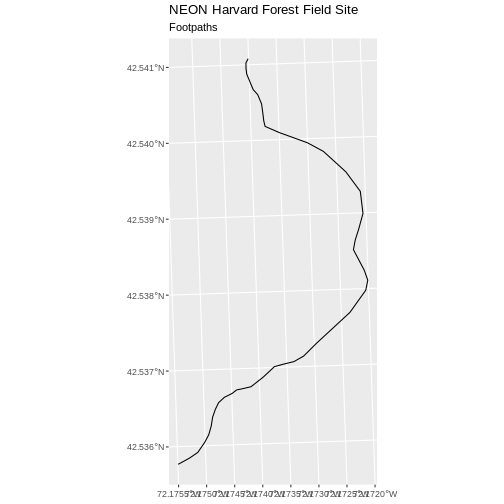
<p class="caption">Map of the footpaths in the study area.</p>
</div>

There are two features in our footpaths subset. Why does the plot look like
there is only one feature? Let's adjust the colors used in our plot. If we have
2 features in our vector object, we can plot each using a unique color by
assigning a column name to the color aesthetic (`color =`). We use the syntax
`aes(color = )` to do this. We can also alter the default line thickness by
using the `linewidth =` parameter, as the default value of 0.5 can be hard to see.
Note that size is placed outside of the `aes()` function, as we are not
connecting line thickness to a data variable.


``` r
ggplot() +
  geom_sf(data = footpath_harv, aes(color = factor(OBJECTID)), linewidth = 1.5) +
  labs(color = 'Footpath ID') +
  ggtitle("NEON Harvard Forest Field Site", subtitle = "Footpaths") +
  coord_sf()
```

<div class="figure" style="text-align: center">
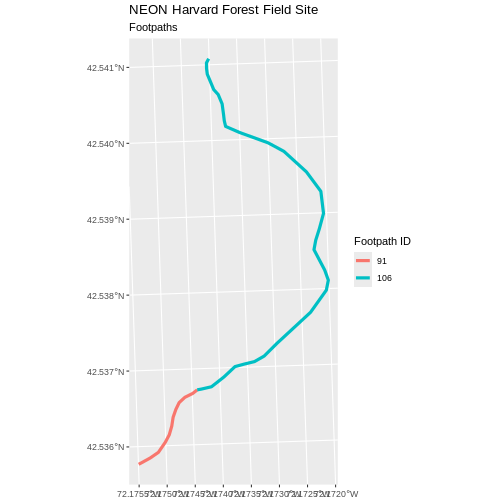
<p class="caption">Map of the footpaths in the study area where each feature is colored differently.</p>
</div>

Now, we see that there are in fact two features in our plot!

:::::::::::::::::::::::::::::::::::::::  challenge

## Challenge: Subset Spatial Line Objects Part 1

Subset out all `boardwalk` from the lines layer and plot it.

:::::::::::::::  solution

## Answers

First we will save an object with only the boardwalk lines:


``` r
boardwalk_harv <- lines_harv %>%
  filter(TYPE == "boardwalk")
```

Let's check how many features there are in this subset:


``` r
nrow(boardwalk_harv)
```

``` output
[1] 1
```

Now let's plot that data:


``` r
ggplot() +
  geom_sf(data = boardwalk_harv, linewidth = 1.5) +
  ggtitle("NEON Harvard Forest Field Site", subtitle = "Boardwalks") +
  coord_sf()
```

<div class="figure" style="text-align: center">
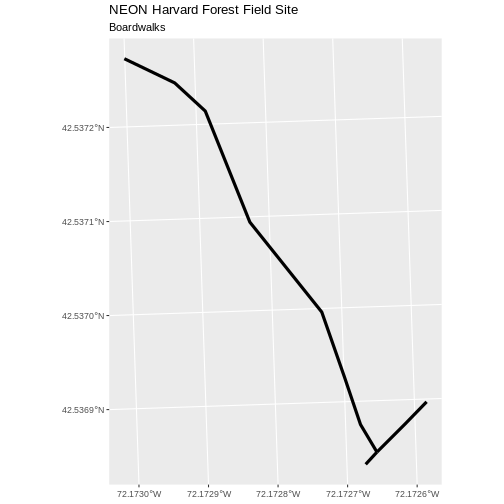
<p class="caption">Map of the boardwalks in the study area.</p>
</div>

:::::::::::::::::::::::::

::::::::::::::::::::::::::::::::::::::::::::::::::

:::::::::::::::::::::::::::::::::::::::  challenge

## Challenge: Subset Spatial Line Objects Part 2

Subset out all `stone wall` features from the lines layer and plot it. For each
plot, color each feature using a unique color.

:::::::::::::::  solution

## Answer

First we will save an object with only the stone wall lines and check the
number of features:


``` r
stonewall_harv <- lines_harv %>%
  filter(TYPE == "stone wall")
nrow(stonewall_harv)
```

``` output
[1] 6
```

Now we can plot the data:


``` r
ggplot() +
  geom_sf(data = stonewall_harv, aes(color = factor(OBJECTID)), linewidth = 1.5) +
  labs(color = 'Wall ID') +
  ggtitle("NEON Harvard Forest Field Site", subtitle = "Stonewalls") +
  coord_sf()
```

<div class="figure" style="text-align: center">
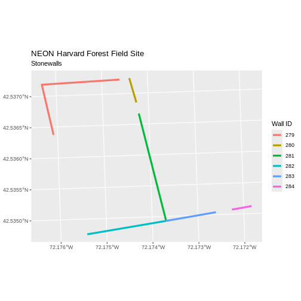
<p class="caption">Map of the stone walls in the study area where each feature is colored differently.</p>
</div>

:::::::::::::::::::::::::

::::::::::::::::::::::::::::::::::::::::::::::::::

## Customize Plots

In the examples above, `ggplot()` automatically selected colors for each line
based on a default color order. If we don't like those default colors, we can
create a vector of colors - one for each feature.

First we will check how many unique values our TYPE attribute has:


``` r
unique(lines_harv$TYPE)
```

``` output
[1] "woods road" "footpath"   "stone wall" "boardwalk" 
```

Then we can create a palette of four colors, one for each
feature in our vector object.


``` r
road_colors <- c("blue", "green", "navy", "purple")
```

We can tell `ggplot` to use these colors when we plot the data.


``` r
ggplot() +
  geom_sf(data = lines_harv, aes(color = TYPE)) +
  scale_color_manual(values = road_colors) +
  labs(color = 'Road Type') +
  ggtitle("NEON Harvard Forest Field Site", subtitle = "Roads & Trails") +
  coord_sf()
```

<div class="figure" style="text-align: center">
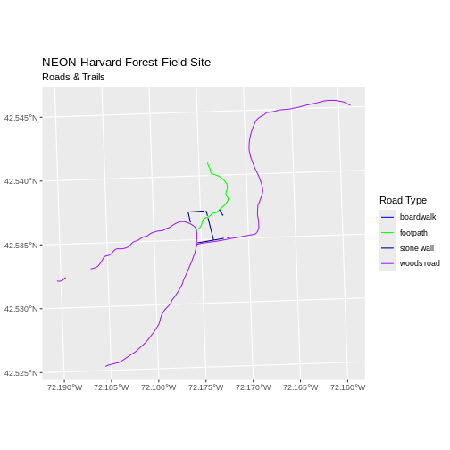
<p class="caption">Roads and trails in the area.</p>
</div>


### Adjust Line Width

We adjusted line width universally earlier. If we want a unique line width for
each attribute category in our spatial object, we can use the
same syntax that we used for colors, above.

We already know that we have four different `TYPE`s in the lines\_HARV object,
so we will set four different line widths.


``` r
line_widths <- c(1, 2, 3, 4)
```

We can use those line widths when we plot the data.


``` r
ggplot() +
  geom_sf(data = lines_harv, aes(color = TYPE, linewidth = TYPE)) +
  scale_color_manual(values = road_colors) +
  labs(color = 'Road Type') +
  scale_linewidth_manual(values = line_widths) +
  ggtitle("NEON Harvard Forest Field Site",
          subtitle = "Roads & Trails - Line width varies") +
  coord_sf()
```

<div class="figure" style="text-align: center">
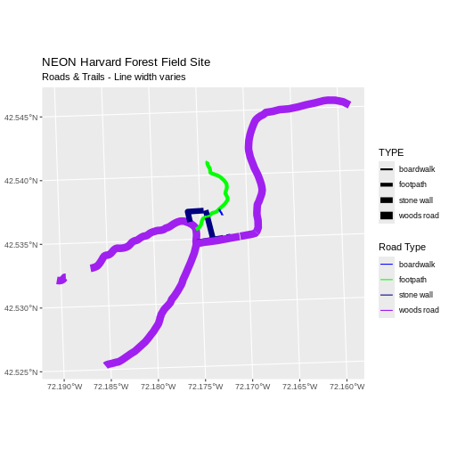
<p class="caption">Roads and trails in the area demonstrating how to use different line thickness and colors.</p>
</div>


:::::::::::::::::::::::::::::::::::::::  challenge

## Challenge: Plot Line Width by Attribute

In the example above, we set the line widths to be 1, 2, 3, and 4. Because R
orders alphabetically by default, this gave us a plot where woods roads (the
last type) were the thickest and boardwalks were the thinnest.

Let's create another plot where we show the different line types with the
following thicknesses:

1. woods road size = 6
2. boardwalks size = 1
3. footpath size = 3
4. stone wall size = 2

:::::::::::::::  solution

## Answers

First we need to look at the values of our data to see
what order the road types are in:


``` r
unique(lines_harv$TYPE)
```

``` output
[1] "woods road" "footpath"   "stone wall" "boardwalk" 
```

We then can create our `line_width` vector setting each of the
levels to the desired thickness.


``` r
line_width <- c(1, 3, 2, 6)
```

Now we can create our plot.


``` r
ggplot() +
  geom_sf(data = lines_harv, aes(linewidth = TYPE)) +
  scale_linewidth_manual(values = line_width) +
  ggtitle("NEON Harvard Forest Field Site",
          subtitle = "Roads & Trails - Line width varies") +
  coord_sf()
```

<div class="figure" style="text-align: center">
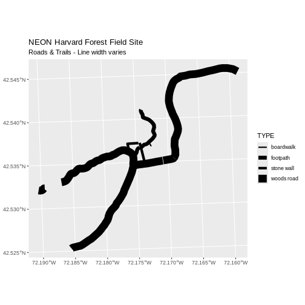
<p class="caption">Roads and trails in the area with different line thickness for each type of paths.</p>
</div>

:::::::::::::::::::::::::

::::::::::::::::::::::::::::::::::::::::::::::::::

### Add Plot Legend

We can add a legend to our plot too. When we add a legend, we use the following
elements to specify labels and colors:


Let's add a legend to our plot. We will use the `road_colors` object
that we created above to color the legend. We can customize the
appearance of our legend by manually setting different parameters.


``` r
ggplot() +
  geom_sf(data = lines_harv, aes(color = TYPE), linewidth = 1.5) +
  scale_color_manual(values = road_colors) +
  labs(color = 'Road Type') +
  ggtitle("NEON Harvard Forest Field Site",
          subtitle = "Roads & Trails - Default Legend") +
  coord_sf()
```

<div class="figure" style="text-align: center">
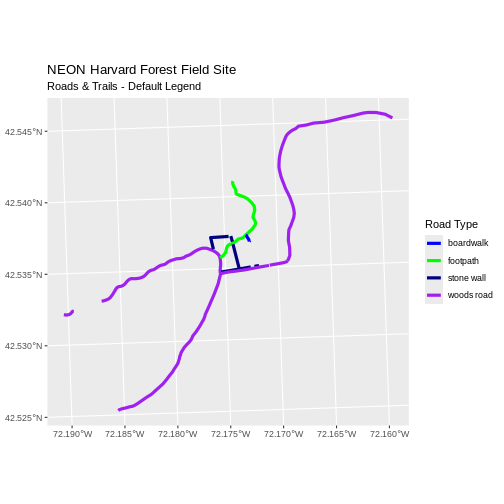
<p class="caption">Roads and trails in the study area using thicker lines than the previous figure.</p>
</div>

We can change the appearance of our legend by manually setting different
parameters.

- `legend.text`: change the font size
- `legend.box.background`: add an outline box


``` r
ggplot() +
  geom_sf(data = lines_harv, aes(color = TYPE), linewidth = 1.5) +
  scale_color_manual(values = road_colors) +
  labs(color = 'Road Type') +
  theme(legend.text = element_text(size = 20),
        legend.box.background = element_rect(linewidth = 1)) +
  ggtitle("NEON Harvard Forest Field Site",
          subtitle = "Roads & Trails - Modified Legend") +
  coord_sf()
```

<div class="figure" style="text-align: center">
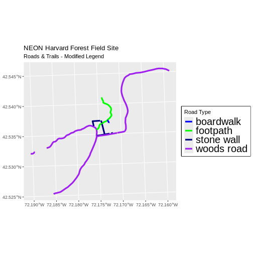
<p class="caption">Map of the paths in the study area with large-font and border around the legend.</p>
</div>


``` r
new_colors <- c("springgreen", "blue", "magenta", "orange")

ggplot() +
  geom_sf(data = lines_harv, aes(color = TYPE), linewidth = 1.5) +
  scale_color_manual(values = new_colors) +
  labs(color = 'Road Type') +
  theme(legend.text = element_text(size = 20),
        legend.box.background = element_rect(size = 1)) +
  ggtitle("NEON Harvard Forest Field Site",
          subtitle = "Roads & Trails - Pretty Colors") +
  coord_sf()
```

``` warning
Warning: The `size` argument of `element_rect()` is deprecated as of ggplot2 3.4.0.
ℹ Please use the `linewidth` argument instead.
This warning is displayed once per session.
Call `lifecycle::last_lifecycle_warnings()` to see where this warning was
generated.
```

<div class="figure" style="text-align: center">
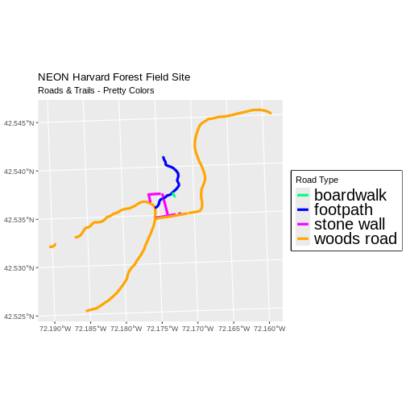
<p class="caption">Map of the paths in the study area using a different color palette.</p>
</div>

:::::::::::::::::::::::::::::::::::::::::  callout

## Data Tip

You can modify the default R color palette using the palette method. For
example `palette(rainbow(6))` or `palette(terrain.colors(6))`. You can reset
the palette colors using `palette("default")`!

You can also use colorblind-friendly palettes such as those in the
[viridis package](https://cran.r-project.org/package=viridis).


::::::::::::::::::::::::::::::::::::::::::::::::::

:::::::::::::::::::::::::::::::::::::::  challenge

## Challenge: Plot Lines by Attribute

Create a plot that emphasizes only roads where bicycles and horses are allowed.
To emphasize this, make the lines where bicycles are not allowed THINNER than
the roads where bicycles are allowed.
NOTE: this attribute information is located in the `lines_harv$BicyclesHo`
attribute.

Be sure to add a title and legend to your map. You might consider a color
palette that has all bike/horse-friendly roads displayed in a bright color. All
other lines can be black.

:::::::::::::::  solution

## Answers

First we explore the `BicyclesHo` attribute to learn the values that correspond
to the roads we need.


``` r
lines_harv %>%
  pull(BicyclesHo) %>%
  unique()
```

``` output
[1] "Bicycles and Horses Allowed"     NA                               
[3] "DO NOT SHOW ON REC MAP"          "Bicycles and Horses NOT ALLOWED"
```

Now, we can create a data frame with only those roads where bicycles and horses 
are allowed.


``` r
roads_bike_horse <-
  lines_harv %>%
  filter(BicyclesHo == "Bicycles and Horses Allowed")
```

Finally, we plot the needed roads after setting them to magenta and a thicker 
line width.


``` r
ggplot() +
  geom_sf(data = lines_harv) +
  geom_sf(data = roads_bike_horse, aes(color = BicyclesHo), linewidth = 2) +
  scale_color_manual(values = "magenta") +
  ggtitle("NEON Harvard Forest Field Site",
          subtitle = "Roads Where Bikes and Horses Are Allowed") +
  coord_sf()
```

<div class="figure" style="text-align: center">
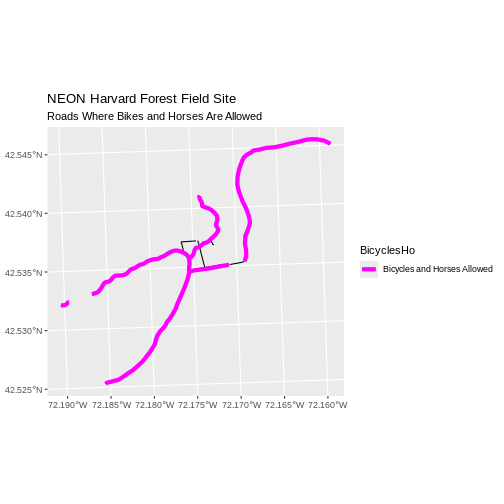
<p class="caption">Roads and trails in the area highlighting paths where horses and bikes are allowed.</p>
</div>

:::::::::::::::::::::::::

::::::::::::::::::::::::::::::::::::::::::::::::::

:::::::::::::::::::::::::::::::::::::::  challenge

## Challenge: Plot Polygon by Attribute

1. Create a map of the state boundaries in the United States using the data
  located in your downloaded data folder: `NEON-DS-Site-Layout-Files/US-Boundary-Layers/US-State-Boundaries-Census-2014`.
  Apply a line color to each state using its `region` value. Add a legend.

:::::::::::::::  solution

## Answers

First we read in the data and check how many levels there are in the `region`
column:


``` r
state_boundary_us <-
st_read("data/NEON-DS-Site-Layout-Files/US-Boundary-Layers/US-State-Boundaries-Census-2014.shp") %>%
# NOTE: We need neither Z nor M coordinates!
st_zm()
```

``` output
Reading layer `US-State-Boundaries-Census-2014' from data source 
  `/home/runner/work/r-raster-vector-geospatial/r-raster-vector-geospatial/site/built/data/NEON-DS-Site-Layout-Files/US-Boundary-Layers/US-State-Boundaries-Census-2014.shp' 
  using driver `ESRI Shapefile'
Simple feature collection with 58 features and 10 fields
Geometry type: MULTIPOLYGON
Dimension:     XYZ
Bounding box:  xmin: -124.7258 ymin: 24.49813 xmax: -66.9499 ymax: 49.38436
z_range:       zmin: 0 zmax: 0
Geodetic CRS:  WGS 84
```

``` r
state_boundary_us$region <- as.factor(state_boundary_us$region)
levels(state_boundary_us$region)
```

``` output
[1] "Midwest"   "Northeast" "Southeast" "Southwest" "West"     
```

Next we set a color vector with that many items:


``` r
colors <- c("purple", "springgreen", "yellow", "brown", "navy")
```

Now we can create our plot:


``` r
ggplot() +
  geom_sf(data = state_boundary_us, aes(color = region), linewidth = 1) +
  scale_color_manual(values = colors) +
  ggtitle("Contiguous U.S. State Boundaries") +
  coord_sf()
```

<div class="figure" style="text-align: center">
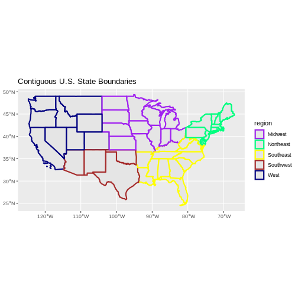
<p class="caption">Map of the continental United States where the state lines are colored by region.</p>
</div>

:::::::::::::::::::::::::

::::::::::::::::::::::::::::::::::::::::::::::::::


:::::::::::::::::::::::::::::::::::::::: keypoints

- Spatial objects in `sf` are similar to standard data frames and can be
  manipulated using the same functions.
- Almost any feature of a plot can be customized using the various functions
  and options in the `ggplot2` package.

::::::::::::::::::::::::::::::::::::::::::::::::::

# this comes from old episode 8 (Plot Multiple Vector Layers)

## Plotting Multiple Vector Layers

In the [previous episode](07-vector-shapefile-attributes-in-r/), we learned how
to plot information from a single vector layer and do some plot customization
including adding a custom legend. However, what if we want to create a more
complex plot with many vector layers and unique symbols that need to be
represented clearly in a legend?

Now, let's create a plot that combines our tower location (`point_harv`), site
boundary (`aoi_boundary_harv`) and roads (`lines_harv`) spatial objects. We
will need to build a custom legend as well.

To begin, we will create a plot with the site boundary as the first layer. Then
layer the tower location and road data on top using `+`.


``` r
ggplot() +
  geom_sf(data = aoi_boundary_harv, fill = "grey", color = "grey") +
  geom_sf(data = lines_harv, aes(color = TYPE), size = 1) +
  geom_sf(data = point_harv) +
  ggtitle("NEON Harvard Forest Field Site") +
  coord_sf()
```

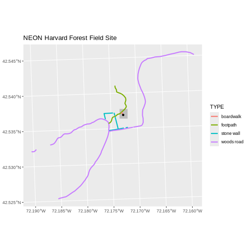

Next, let's build a custom legend using the symbology (the colors and symbols)
that we used to create the plot above. For example, it might be good if the
lines were symbolized as lines. In the previous episode, you may have noticed
that the default legend behavior for `geom_sf` is to draw a 'patch' for each
legend entry. If you want the legend to draw lines or points, you need to add
an instruction to the `geom_sf` call - in this case, `show.legend = 'line'`.


``` r
ggplot() +
  geom_sf(data = aoi_boundary_harv, fill = "grey", color = "grey") +
  geom_sf(data = lines_harv, aes(color = TYPE),
          show.legend = "line", size = 1) +
  geom_sf(data = point_harv, aes(fill = Sub_Type), color = "black") +
  scale_color_manual(values = road_colors) +
  scale_fill_manual(values = "black") +
  ggtitle("NEON Harvard Forest Field Site") +
  coord_sf()
```

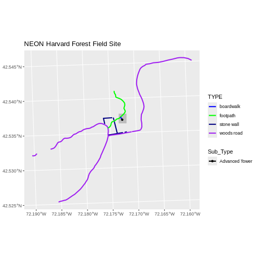

Now lets adjust the legend titles by passing a `name` to the respective `color`
and `fill` palettes.


``` r
ggplot() +
  geom_sf(data = aoi_boundary_harv, fill = "grey", color = "grey") +
  geom_sf(data = point_harv, aes(fill = Sub_Type)) +
  geom_sf(data = lines_harv, aes(color = TYPE), show.legend = "line",
          size = 1) +
  scale_color_manual(values = road_colors, name = "Line Type") +
  scale_fill_manual(values = "black", name = "Tower Location") +
  ggtitle("NEON Harvard Forest Field Site") +
  coord_sf()
```


Finally, it might be better if the points were symbolized as a symbol. We can
customize this using `shape` parameters in our call to `geom_sf`: 16 is a point
symbol, 15 is a box.

:::::::::::::::::::::::::::::::::::::::::  callout

## Data Tip

To view a short list of `shape` symbols,
type `?pch` into the R console.


::::::::::::::::::::::::::::::::::::::::::::::::::


``` r
ggplot() +
  geom_sf(data = aoi_boundary_harv, fill = "grey", color = "grey") +
  geom_sf(data = point_harv, aes(fill = Sub_Type), shape = 15) +
  geom_sf(data = lines_harv, aes(color = TYPE),
          show.legend = "line", size = 1) +
  scale_color_manual(values = road_colors, name = "Line Type") +
  scale_fill_manual(values = "black", name = "Tower Location") +
  ggtitle("NEON Harvard Forest Field Site") +
  coord_sf()
```

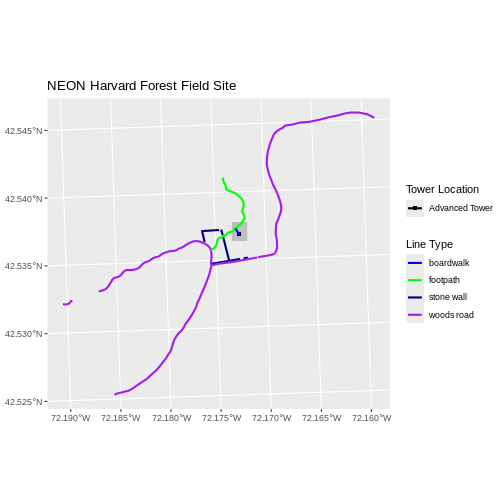

:::::::::::::::::::::::::::::::::::::::  challenge

## Challenge: Plot Polygon by Attribute

1. Using the `NEON-DS-Site-Layout-Files/HARV/PlotLocations_HARV.shp` ESRI `shapefile`,
  create a map of study plot locations, with each point colored by the soil
  type (`soilTypeOr`). How many different soil types are there at this
  particular field site? Overlay this layer on top of the `lines_harv` layer
  (the roads). Create a custom legend that applies line symbols to lines and
  point symbols to the points.

2. Modify the plot above. Tell R to plot each point, using a different symbol
   of `shape` value.

:::::::::::::::  solution

## Answers

First we need to read in the data and see how many unique soils are represented
in the `soilTypeOr` attribute.


``` r
plot_locations <-
  st_read("data/NEON-DS-Site-Layout-Files/HARV/PlotLocations_HARV.shp")
```

``` output
Reading layer `PlotLocations_HARV' from data source 
  `/home/runner/work/r-raster-vector-geospatial/r-raster-vector-geospatial/site/built/data/NEON-DS-Site-Layout-Files/HARV/PlotLocations_HARV.shp' 
  using driver `ESRI Shapefile'
Simple feature collection with 21 features and 25 fields
Geometry type: POINT
Dimension:     XY
Bounding box:  xmin: 731405.3 ymin: 4712845 xmax: 732275.3 ymax: 4713846
Projected CRS: WGS 84 / UTM zone 18N
```

``` r
plot_locations$soilTypeOr <- as.factor(plot_locations$soilTypeOr)
levels(plot_locations$soilTypeOr)
```

``` output
[1] "Histosols"   "Inceptisols"
```

Next we can create a new color palette with one color for each soil type.


``` r
blue_orange <- c("cornflowerblue", "darkorange")
```

Finally, we will create our plot.


``` r
ggplot() +
  geom_sf(data = lines_harv, aes(color = TYPE), show.legend = "line") +
  geom_sf(data = plot_locations, aes(fill = soilTypeOr),
          shape = 21, show.legend = 'point') +
  scale_color_manual(name = "Line Type", values = road_colors,
     guide = guide_legend(override.aes = list(linetype = "solid",
                                              shape = NA))) +
  scale_fill_manual(name = "Soil Type", values = blue_orange,
     guide = guide_legend(override.aes = list(linetype = "blank", shape = 21,
                                              colour = "black"))) +
  ggtitle("NEON Harvard Forest Field Site") +
  coord_sf()
```

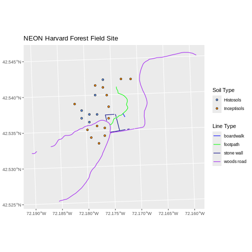

If we want each soil to be shown with a different symbol, we can give multiple
values to the `scale_shape_manual()` argument.


``` r
ggplot() +
  geom_sf(data = lines_harv, aes(color = TYPE), show.legend = "line", size = 1) +
  geom_sf(data = plot_locations, aes(fill = soilTypeOr, shape = soilTypeOr),
          show.legend = 'point', size = 3) +
  scale_shape_manual(name = "Soil Type", values = c(21, 22)) +
  scale_color_manual(name = "Line Type", values = road_colors,
     guide = guide_legend(override.aes = list(linetype = "solid", shape = NA))) +
  scale_fill_manual(name = "Soil Type", values = blue_orange,
     guide = guide_legend(override.aes = list(linetype = "blank", shape = c(21, 22), color = "black"))) +
  ggtitle("NEON Harvard Forest Field Site") +
  coord_sf()
```

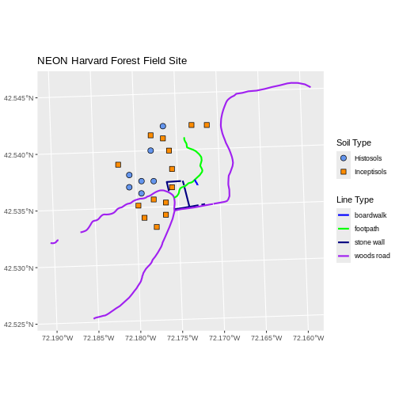

:::::::::::::::::::::::::

::::::::::::::::::::::::::::::::::::::::::::::::::
