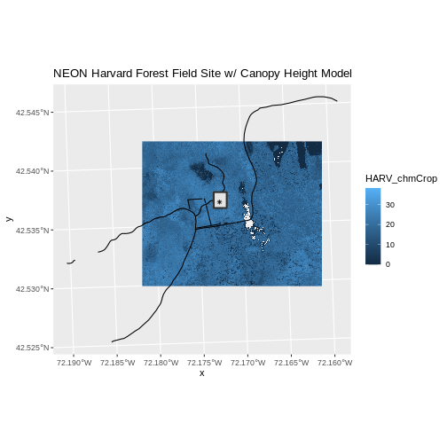

::::::::::::::::::::::::::::::::::::::: objectives

- Plot multiple vector layers in the same plot.
- Apply custom symbols to spatial objects in a plot.
- Create a multi-layered plot with raster and vector data.

::::::::::::::::::::::::::::::::::::::::::::::::::

:::::::::::::::::::::::::::::::::::::::: questions

- How can I create map compositions with custom legends using ggplot?
- How can I plot raster and vector data together?

::::::::::::::::::::::::::::::::::::::::::::::::::


::::::::::::::::::::::::::::::::::::::::::  prereq

## Things You'll Need To Complete This Episode

See the [lesson homepage](.) for detailed information about the software, data,
and other prerequisites you will need to work through the examples in this
episode.


::::::::::::::::::::::::::::::::::::::::::::::::::

This episode builds upon
[the previous episode](https://datacarpentry.org/r-raster-vector-geospatial/07-vector-shapefile-attributes-in-r)
to work with vector layers in R and explore how to plot multiple
vector layers. It also covers how to plot raster and vector data together on the
same plot.

## Load the Data

To work with vector data in R, we can use the `sf` library. The `terra`
package also allows us to explore metadata using similar commands for both
raster and vector files. Make sure that you have these packages loaded.

We will continue to work with the three ESRI `shapefile` that we loaded in the
[Open and Plot Vector Layers in R](https://datacarpentry.org/r-raster-vector-geospatial/06-vector-open-shapefile-in-r) episode.


:::::::::::::::::::::::::::::::::::::::  challenge

## Challenge: Plot Raster \& Vector Data Together

You can plot vector data layered on top of raster data using the `+` to add a
layer in `ggplot`. Create a plot that uses the NEON AOI Canopy Height Model
`data/NEON-DS-Airborne-Remote-Sensing/HARV/CHM/HARV_chmCrop.tif` as a base
layer. On top of the CHM, please add:

- The study site AOI.
- Roads.
- The tower location.

Be sure to give your plot a meaningful title.

:::::::::::::::  solution

## Answers


``` r
ggplot() +
  geom_raster(data = chm_harv_df, aes(x = x, y = y, fill = HARV_chmCrop)) +
  geom_sf(data = lines_harv, color = "black") +
  geom_sf(data = aoi_boundary_harv, color = "grey20", size = 1) +
  geom_sf(data = point_harv, pch = 8) +
  ggtitle("NEON Harvard Forest Field Site w/ Canopy Height Model") +
  coord_sf()
```



:::::::::::::::::::::::::

::::::::::::::::::::::::::::::::::::::::::::::::::


:::::::::::::::::::::::::::::::::::::::: keypoints

- Use the `+` operator to add multiple layers to a ggplot.
- Multi-layered plots can combine raster and vector datasets.
- Use the `show.legend` argument to set legend symbol types.
- Use the `scale_fill_manual()` function to set legend colors.

::::::::::::::::::::::::::::::::::::::::::::::::::


